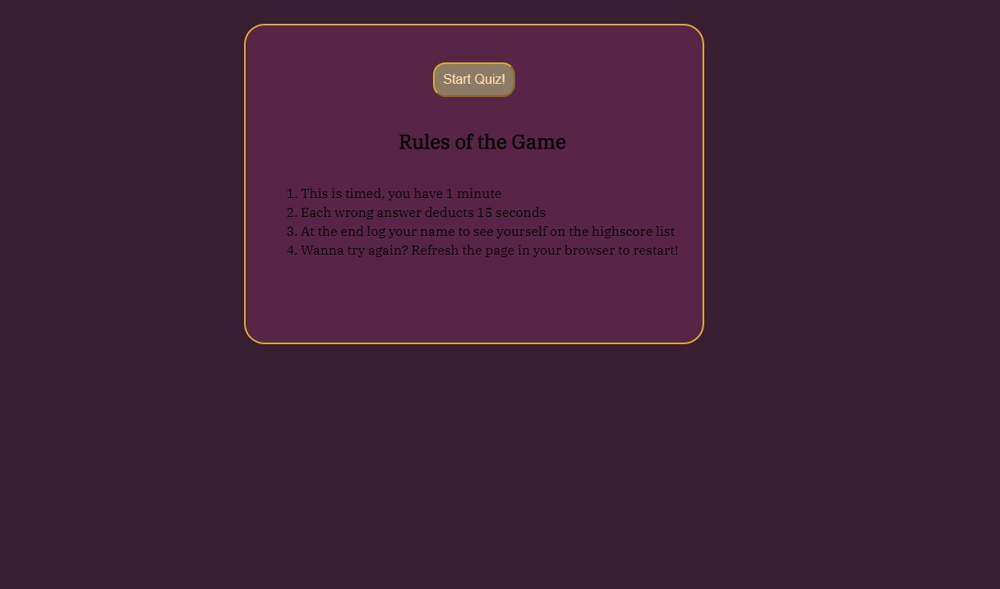

# brainPicker

## Description

This weeks challenge was to create a coding quiz from scratch! It has a functional time keeping element that decrements for each wrong answer selected. The quiz consists of five questions and three answer choices. Additionally, it logs the users score and name and outputs it to a leaderboard! Try your luck and see how many you can get right!


## User Story

```
AS A coding boot camp student
I WANT to take a timed quiz on JavaScript fundamentals that stores high scores
SO THAT I can gauge my progress compared to my peers
```

## Acceptance Criteria

```
GIVEN I am taking a code quiz
WHEN I click the start button
THEN a timer starts and I am presented with a question
WHEN I answer a question
THEN I am presented with another question
WHEN I answer a question incorrectly
THEN time is subtracted from the clock
WHEN all questions are answered or the timer reaches 0
THEN the game is over
WHEN the game is over
THEN I can save my initials and my score
```

## Screenshots




## Link to deployed site


## License

No Licenses were used